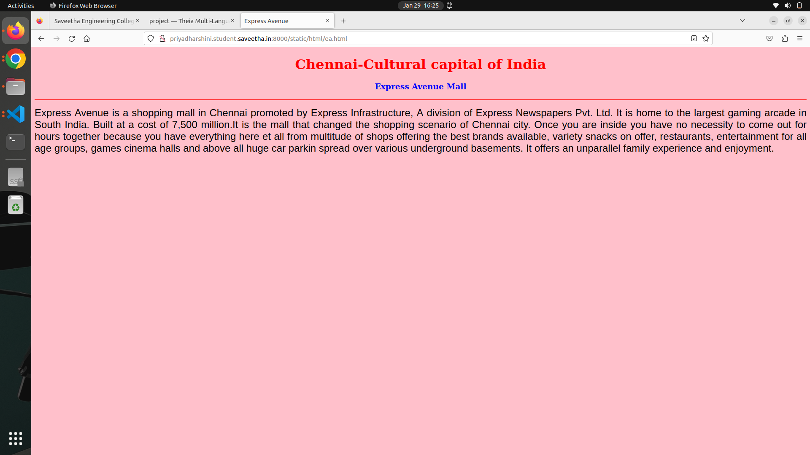
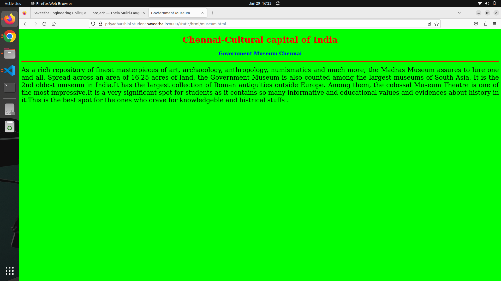
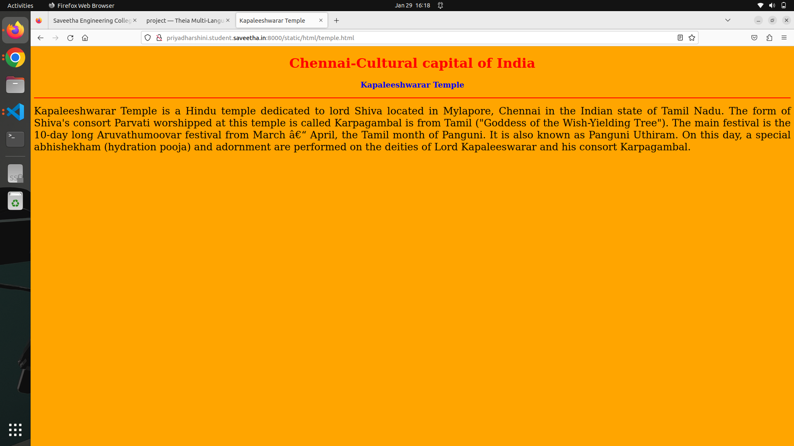

# Places Around Me
## AIM:
To develop a website to display details about the places around my house.

## Design Steps:

### Step 1:
Clone the github repository into Theia IDE.
### Step 2:
Create a new Django project
## Step 3:
Write the required HTML code 
## Step 4:
Run the Django server and execute the HTML files.

## Code:
```
map.html

<!DOCTYPE html>
<html lang="en">
    <head>
        <title>My City</title>
    </head>
    <body>
        <h1 align="center">
            <font color="red"><b>Chennai-Cultural capital of India</b></font>
        </h1>
        <h3 align="center">
            <font color="blue"><b>Priyadharshini.P (22008758)</b></font>
        </h3>
        <center>
            
            <map name="image-maps-2023-01-29-095417">
                <area title="marina" href="marina.html" shape="rect" coords="1078,363,1128,413"/>
                <area title="museum" href="museum.html" shape="rect" coords="752,107,859,186"/>
                <area title="temple" href="temple.html" shape="rect" coords="846,562,1001,661"/>
                <area title="sen" href="sen.html" shape="rect" coords="695,366,794,419"/>
                <area title="ea" href="ea.html" shape="rect" coords="864,257,963,310" />
            </map>
        </centre>
    </body>
</html>

ea.html

<!DOCTYPE html>
<html lang="en">
    <head>
        <title>Express Avenue</title>
    </head>
    <body bgcolor="pink">
        <h1 align="center">
            <font color="red"><b>Chennai-Cultural capital of India</b></font>
        </h1>
        <h3 align="center">
            <font color="blue"><b>Express Avenue Mall</b></font>
        </h3>
        <hr size="3" color="red">
        <p align="justify">
            <font face="Arial" size="5">
Express Avenue is a shopping mall in Chennai promoted by Express Infrastructure, A division of Express Newspapers Pvt. Ltd. 
It is home to the largest gaming arcade in South India. Built at a cost of 7,500 million.It is the mall that changed the shopping scenario of Chennai city. 
Once you are inside you have no necessity to come out for hours together because you have everything here et all from multitude of shops offering the best brands available, variety snacks on offer, restaurants, entertainment for all age groups, games cinema halls and above all huge car parkin spread over various underground basements. 
It offers an unparallel family experience and enjoyment.
            </font>
        </p>
    </body>
</html>

marina.html

<!DOCTYPE html>
<html lang="en">
<head>
<title>Marina Beach</title>
</head>
<body bgcolor="yellow">
<h1 align="center">
<font color="red"><b>Chennai-Cultural capital of India</b></font>
</h1>
<h3 align="center">
<font color="blue"><b>Marina Beach-Pride of Chennai</b></font>
</h3>
<hr size="3" color="red">
<p align="justify">
<font face="Tahoma" size="5">
Marina beach in Chennai along the Bay of Bengal is India's longest and world's second longest beach.
This predominantly sandy of nearly 12 kilometers extends from Beasant Nagar in the south to Fort St. George in the north. 
Chennai Marina beach was renovated by Governor Mountstuart Elphinstone Grant Duff in 1880s. A long stretch of soft sand,
Marina Beach invites tourists to unwind, take a dip in the water and indulge in local snacks. Thus it is called as the Pride of Chennai.
</font>
</p>
</body>
</html>

museum.html

<!DOCTYPE html>
<html lang="en">
<head>
<title>Govternment Museum</title>
</head>
<body bgcolor="lime">
<h1 align="center">
<font color="red"><b>Chennai-Cultural capital of India</b></font>
</h1>
<h3 align="center">
<font color="blue"><b>Government Museum Chennai</b></font>
</h3>
<hr size="3" color="red">
<p align="justify">
<font face="Georgia" size="5">
As a rich repository of finest masterpieces of art, archaeology, anthropology, numismatics and much more, 
the Madras Museum assures to lure one and all. Spread across an area of 16.25 acres of land, 
the Government Museum is also counted among the largest museums of South Asia.
It is the 2nd oldest museum in India.It has the largest collection of Roman antiquities outside Europe. 
Among them, the colossal Museum Theatre is one of the most impressive.It is a very significant spot for students as it contains so many informative and educational values and evidences about history in it.This is the best spot for the ones who crave for knowledgeble and histrical stuffs
.
</font>
</p>
</body>
</html>

sen.html

<!DOCTYPE html>
<html lang="en">
<head>
<title>Senmozhi Poonga</title>
</head>
<body bgcolor="cyan">
<h1 align="center">
<font color="red"><b>Chennai-Cultural capital of India</b></font>
</h1>
<h3 align="center">
<font color="blue"><b>Senmozhi Poonga</b></font>
</h3>
<hr size="3" color="red">
<p align="justify">
<font face="Courier New" size="5">
<b>
Semmozhi Poonga, which means "Classical Language Park", is a botanical garden in Chennai set up jointly by
the Horticulture and Agricultural Engineering department of the Government of Tamil Nadu.The garden features eight subgardens
displaying flora of different varieties, such as a tree court, mural walk and bonsai, herbal and exotic gardens,
in addition to an artificial duck pond. Incorporating elements of an Indian-Buddhist garden, the garden has a wide variety of indigenous 
species across 22 exclusive areas including palm court, tree court, golden garden, water and rock garden, butterfly garden, fern garden, sunken garden and theme garden
</b>
</font>
</p>
</body>
</html>

temple.html

<!DOCTYPE html>
<html lang="en">
<head>
<title>Kapaleeshwarar Temple</title>
</head>
<body bgcolor="orange">
<h1 align="center">
<font color="red"><b>Chennai-Cultural capital of India</b></font>
</h1>
<h3 align="center">
<font color="blue"><b>Kapaleeshwarar Temple</b></font>
</h3>
<hr size="3" color="red">
<p align="justify">
<font face="Georgia" size="5">
Kapaleeshwarar Temple is a Hindu temple dedicated to lord Shiva located in Mylapore, Chennai in the Indian state of Tamil Nadu. 
The form of Shiva's consort Parvati worshipped at this temple is called Karpagambal is from Tamil ("Goddess of the Wish-Yielding Tree").
The main festival is the 10-day long Aruvathumoovar festival from March – April, the Tamil month of Panguni. It is also known as Panguni Uthiram. On this day, 
a special abhishekham (hydration pooja) and adornment are performed on the deities of Lord Kapaleeswarar and his consort Karpagambal.
</font>
</p>
</body>
</html>
```


## Output:










## Html Validation:

## Result:
The program for implementing image map is executed successsfully.